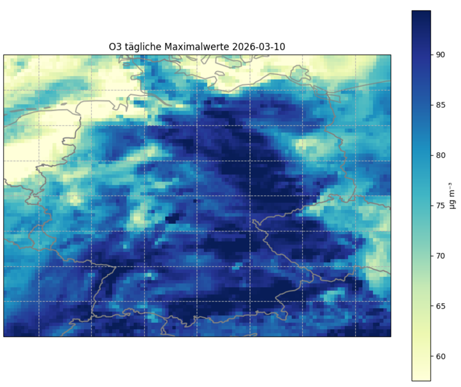

# CAMS Regionale Luftqualitätsvorhersage – Analyse der Ozonkonzentration über Deutschland

Dieses Repository enthält ein Jupyter Notebook zur Analyse von Luftqualitätsvorhersagen des Copernicus Atmosphere Monitoring Service (CAMS) für Deutschland.

---

## Notebook direkt ausführen

Führen Sie das Notebook direkt über kostenlose Cloud-Plattformen aus:

---

## Beispielergebnisse

### Ozonvorhersage – Deutschland

### Zeitreihe – Berlin

---
